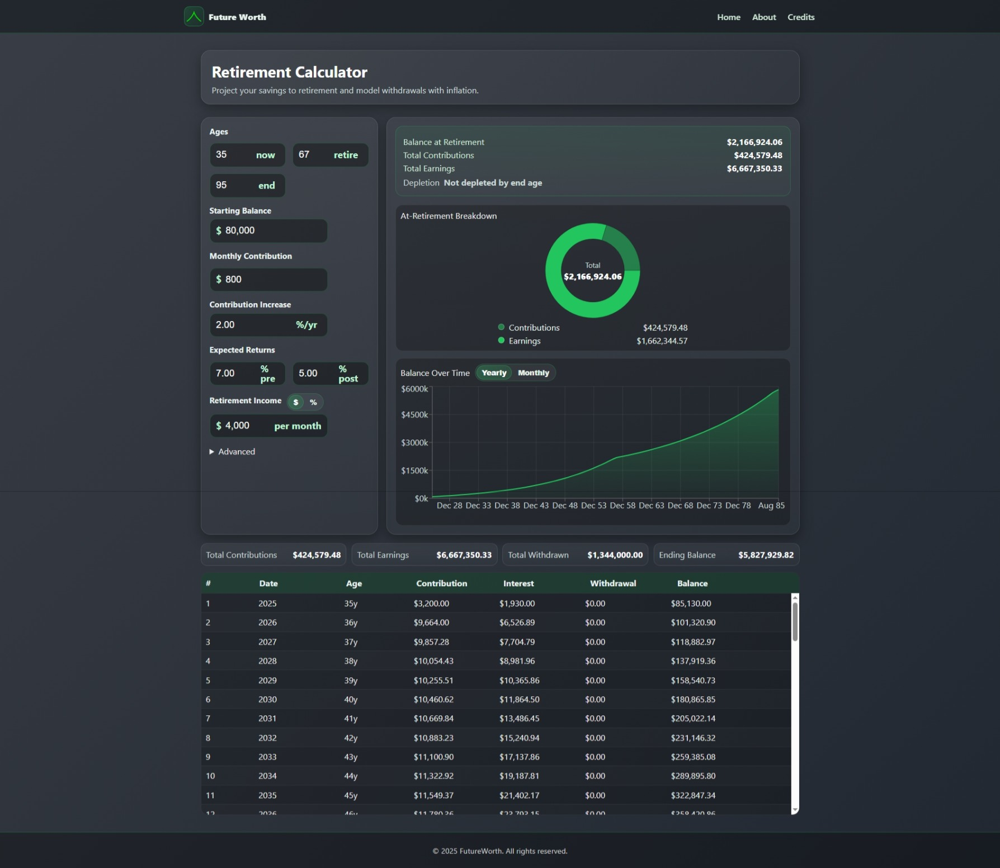

# FutureWorth

FutureWorth is a set of focused, high‑performance financial calculators that make planning approachable and visual. Explore mortgage payments, compound growth, retirement scenarios, and loan payoff strategies — all with responsive charts, full schedules, and clean, per‑component styling.

> Educational only. This app does not provide financial advice.

## Screenshots

- Home

  

- Compound Interest

  

- Mortgage

  

- Retirement Savings

  

- Loan Payoff

  

## Calculators

- Mortgage
  - Estimate P&I, escrow, PMI drop‑off, and payoff date
  - Toggle monthly/yearly chart views and see a full amortization table
  - Granularity toggle syncs chart and table
- Compound Interest
  - Project future value with principal, recurring contributions, annual increases, and inflation
  - Monthly/annual contribution cadence; compounding dropdown
  - Date‑based x‑axis and full contribution/earnings breakdown
- Retirement
  - Model accumulation and drawdown, inflation‑adjusted income, and depletion visibility
  - At‑retirement donut breakdown and synchronized chart/table
- Loan Payoff
  - Compare strategies with monthly + one‑time extra payments, and monthly fees
  - Payoff date, interest saved baseline comparison

## Tech Stack

- React + React Router
- Recharts (responsive charts)
- Sass (SCSS) with strict per‑component BEM
- JavaScript (ESNext)

## Getting Started

Prerequisites:
- Node 18.x (and npm 9.x)

Install all dependencies (root, server, client):

```
npm run install-all
```

Start the dev servers (concurrently runs API + client):

```
npm run dev
```

Build the client for production:

```
npm run build
```

## Project Structure

```
future-worth/
├─ client/                # React app
│  ├─ public/             # Static assets (screenshots, logos, index.html)
│  └─ src/                # Components, styles, utils
├─ server/                # API server (Node)
├─ .gitignore
├─ package.json           # Monorepo scripts
└─ README.md
```

## Contributing / Credits

- Design & Development: Drew
- Built with React, Recharts, and the broader open‑source community

## License

Copyright © 2025. All rights reserved.

